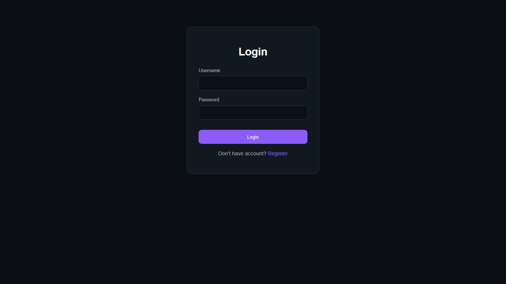
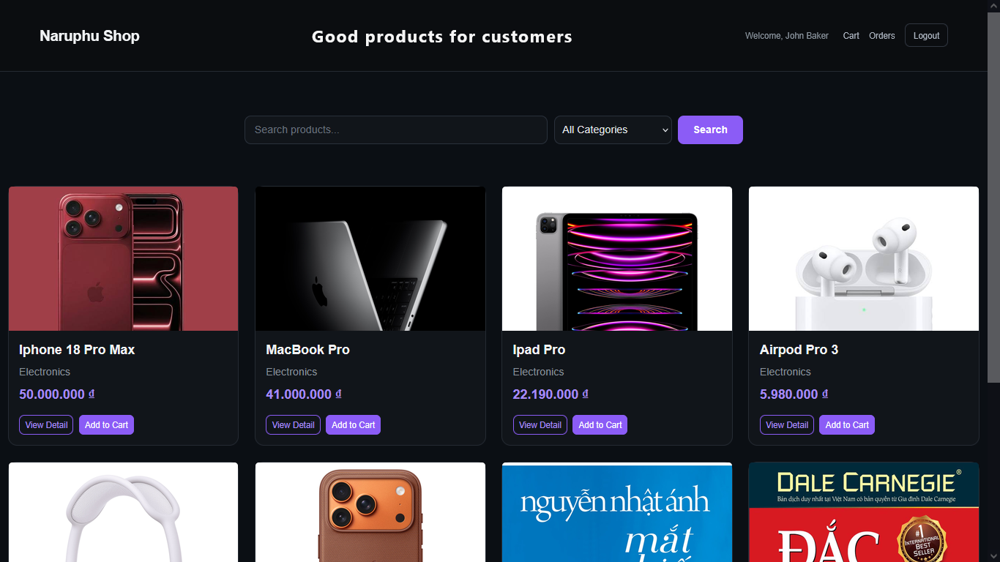
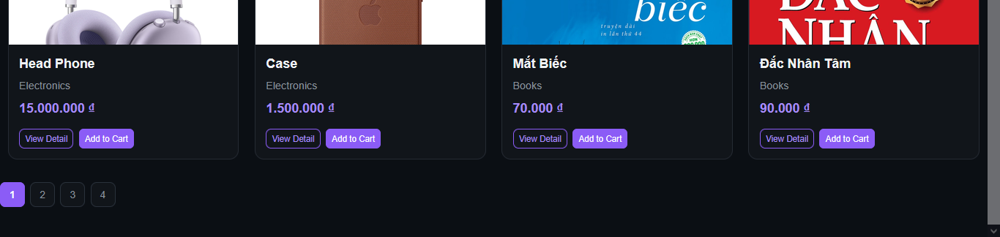
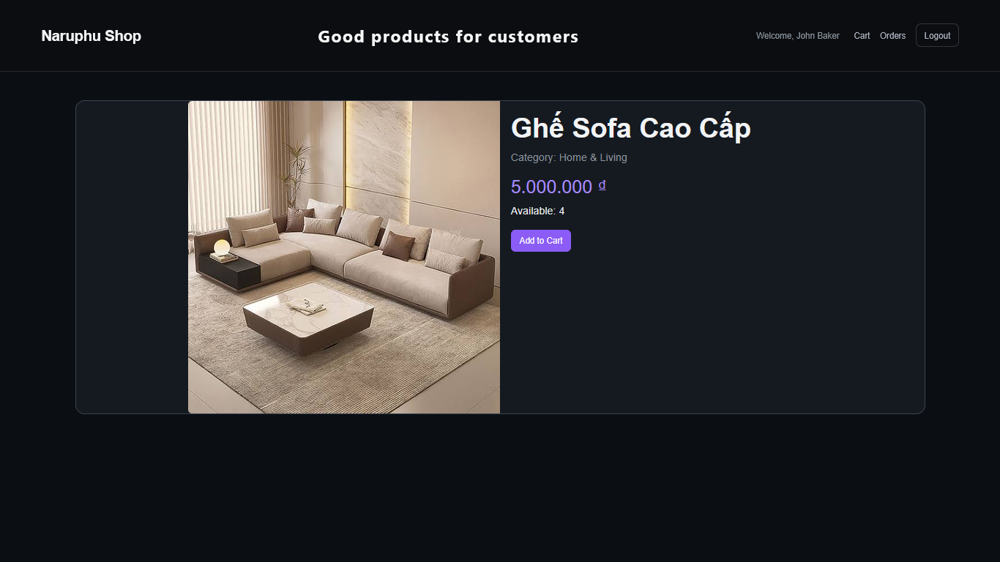
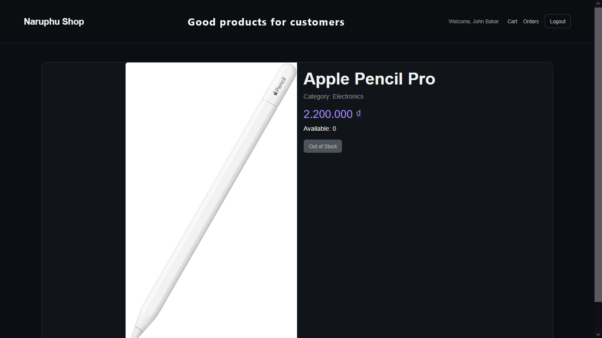
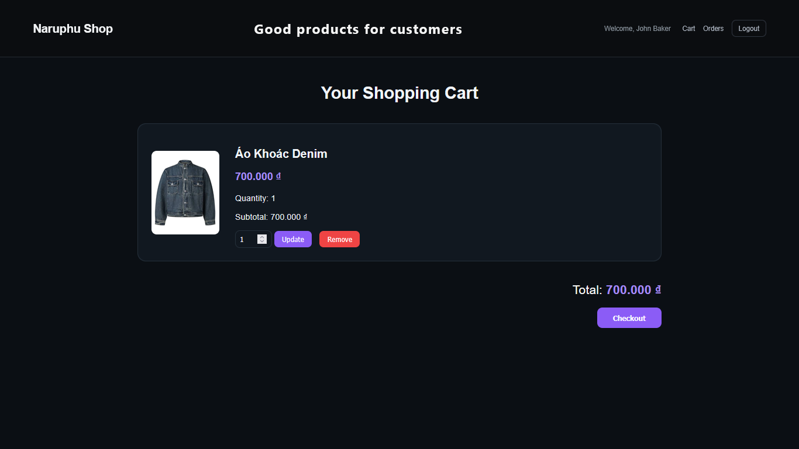
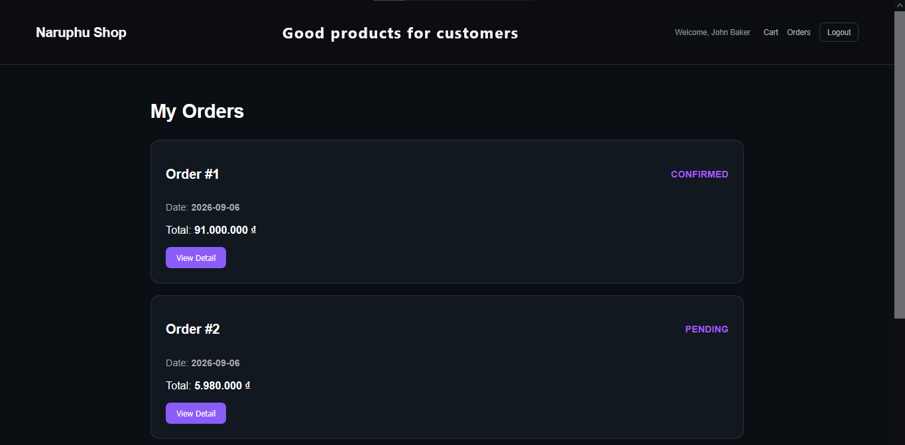
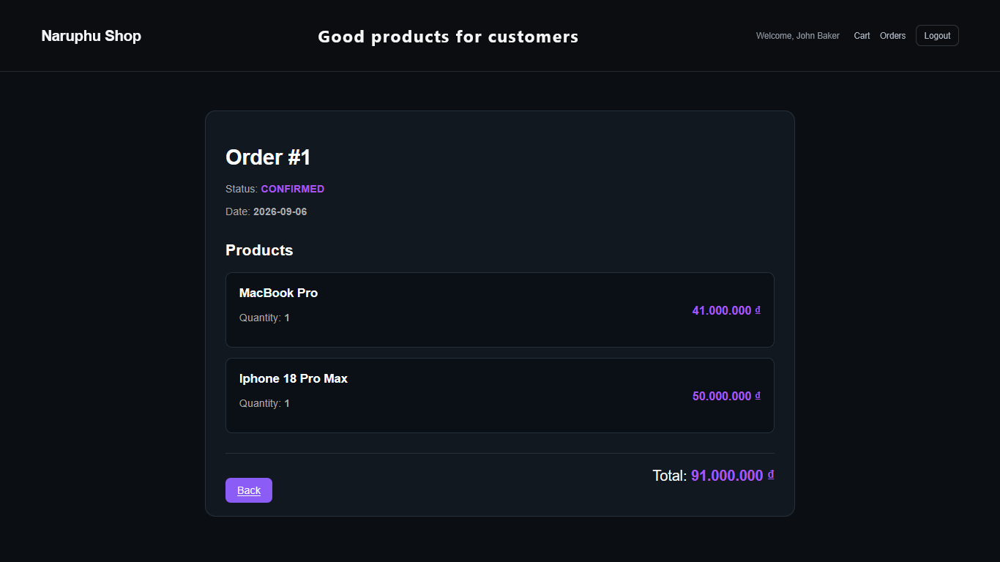
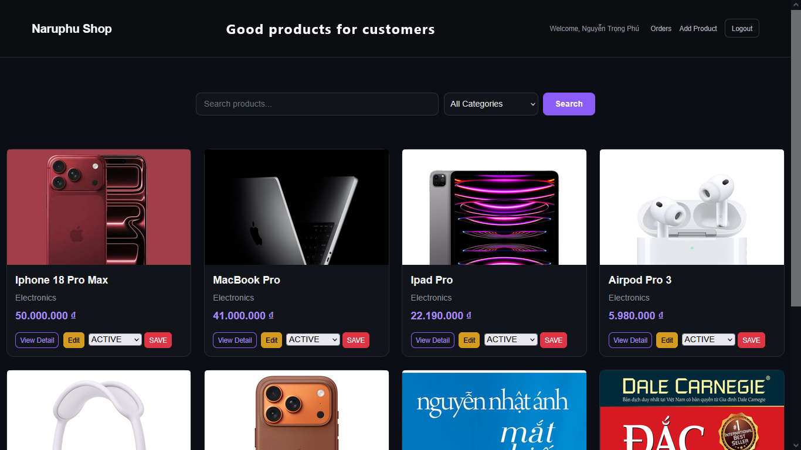
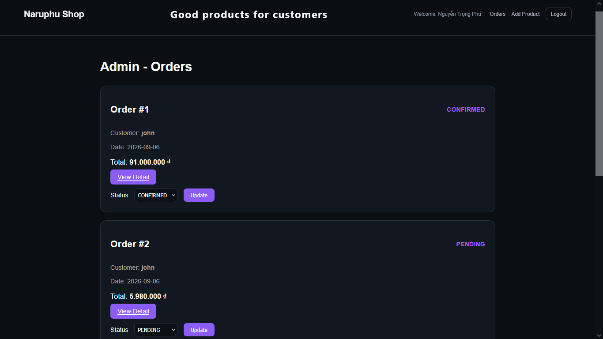

# 🛒 MiniShop

## Java E-commerce Web Application

A backend-focused e-commerce web application built with Java Servlet, JSP, Hibernate ORM and MySQL.

## 🌐 Live Demo

👉 [MiniShop Live Demo](https://minishop-pyrn.onrender.com)

## 🔑 Demo Accounts

### Admin
- Username: `admin`
- Password: `admin123`

### Customer
- Username: `customer`
- Password: `customer123`

This project demonstrates:
- MVC architecture
- Layered backend design
- ORM mapping with Hibernate
- Authentication & Authorization
- Transaction management
- Exception handling
- Database pagination


## 📸 Preview
## Login




## Product Listing




## Product Detail



### Out of stock



## Shopping Cart



## Order Management



### Order Detail



### Admin Product Management




### Admin Order Management



---

# ✨ Features

## 👤 Authentication & Authorization

- User registration
- User login/logout
- Session-based authentication
- Role-based authorization

System roles:

- CUSTOMER
- ADMIN

## Authentication Filter

AuthenticationFilter intercepts incoming requests
and checks user authentication before allowing access
to protected resources.

Responsibilities:

- Verify logged-in session
- Restrict unauthorized access
- Protect secured routes

Access control:

- Customers can access shopping features.
- Administrators can access product and order management features.

---

# 🛍 Customer Features

## Product Browsing

Customers can:

- View available products
- Search products by keyword
- Filter products by category
- View product details
- Navigate products using pagination


## Shopping Cart

Customers can:

- Add products to cart
- Validate product availability before adding


## Order Processing

Customers can:

- Checkout products from cart
- Create orders
- View order history
- View order details


---

# 🔐 Admin Features

## Product Management

Administrators can:

- Create products
- Update product information
- Upload product images
- Change product status

Product status:
- ACTIVE  
- INACTIVE

Inactive products are hidden from customers.
## Order Management

Administrators can:

- View all customer orders
- View order information
- Update order status

```
Order workflow:
```

PENDING  
|  
v  
CONFIRMED  
|  
v  
SHIPPING  
|  
v  
COMPLETED

```

Cancellation flow:
```

PENDING / CONFIRMED  
|  
v  
CANCELLED


When cancelling an order, product quantities are restored.

### Inventory Management

- Product stock tracking
- Prevent adding unavailable products
- Admin can activate/deactivate products

---


# 🏗 Architecture

The project follows **MVC architecture** combined with a **layered backend design**.

## Request Flow

```text
Client Browser

        |
        v

HTTP Request

        |
        v

AuthenticationFilter
(Authentication & Authorization)

        |
        v

Controller Layer
(Servlet)

        |
        v

Service Layer
(Business Logic)

        |
        v

DAO Layer
(Database Access)

        |
        v

Hibernate ORM

        |
        v

MySQL Database
```


## Exception Handling Flow

```text
Controller / Service / DAO

            |
            v

     Exception occurs

            |
            v

     ExceptionFilter

            |
            v

     Error Response
```


---

# 📂 Project Structure

src/main/java

├── controller
│   └── Servlet controllers

├── service
│   └── Business logic layer

├── dao
│   └── Database access layer

├── model
│   └── Entity classes

├── filter
│   └── Authentication & Exception filters

└── util
    └── HibernateUtil, AppContext
    

├── exception
│   └── Custom business exceptions
---
# 💡 Technical Highlights


## Manual Dependency Injection

Instead of creating dependencies directly inside controllers, 
the project uses AppContext to manage Service and DAO objects.

**Example:**

Controller
    |
    v
AppContext
    |
    v
Service
    |
    v
DAO


## Transaction Management

Order operations use Hibernate transactions to maintain data consistency.

Example:

Cancel Order:

- Update order status → CANCELLED
- Restore product quantity

---

# 🗄 Database Design

Main entities:

- User
- Product
- Category
- CartItem
- Order
- OrderItem


Relationships:

Category (1) ---- (N) Product

User (1) ---- (N) Order

Order (1) ---- (N) OrderItem

Product (1) ---- (N) OrderItem

User (1) ---- (N) CartItem

Product (1) ---- (N) CartItem


---

# ⚙️ Backend Implementation Highlights

## Hibernate ORM

Hibernate is used for:

- Entity mapping
- Relationship management
- Database interaction


Implemented mappings:

- Many-to-One relationships
- One-to-Many relationships


**Examples:**

Product -> Category

Order -> OrderItem

OrderItem -> Product

---

# Exception Handling

The project uses centralized exception handling with Servlet Filter.

Flow:

```

Request

        |
        v

ExceptionFilter

        |
        v

chain.doFilter()

        |
        v

Controller / Service / DAO

        |
        v

Exception thrown

        |
        v

ExceptionFilter catches exception

        |
        v

Error Response

```


**Custom exception classes:**
```

AppException

├── ProductException  
├── CartException  
└── OrderException


This helps separate business errors by domain.

---

# 📄 Pagination

The product listing page implements **database-level pagination** to improve performance and optimize product loading.

## Implementation

The application calculates the starting position of each page:

```java
offset = (page - 1) * pageSize;
```

Hibernate applies pagination through:

```java
query.setFirstResult(offset);
query.setMaxResults(pageSize);
```

## Example

With:

```text
pageSize = 8
```

| Page | Offset |
|------|--------|
| Page 1 | 0 |
| Page 2 | 8 |
| Page 3 | 16 |

## Benefits

✅ Reduces database load  
✅ Improves response time  
✅ Avoids loading unnecessary records  
✅ Provides smoother product browsing experience


# 🛠 Tech Stack

## Backend

- Java
- Java Servlet
- Hibernate ORM
- JDBC


## Frontend

- JSP
- JSTL
- HTML
- CSS
- Bootstrap


## Database

- MySQL


## Build Tool

- Maven


## Server

- Apache Tomcat


---
# 🚀 Run Project

## Requirements

- Java 17+
- MySQL
- Maven
- Apache Tomcat 9


## Setup Database

1. **Create MySQL database:**

```sql
CREATE DATABASE minishop;
```

2. **Update database configuration:**
**MySQL username**
**MySQL password**
**Database URL**

3. **Hibernate will automatically create/update tables based on entity mappings.**
5. **Run the application using Apache Tomcat 9.**

6. **Access:** http://localhost:8080/minishop


# 🚀 Future Improvements

Possible improvements:

- Migrate to Spring Boot
- Build REST API
- Implement JWT authentication
- Add unit testing
- Add Docker deployment
- Deploy to cloud platform


---

# 👨‍💻 Author

Phu Nguyen

Java Backend Developer Portfolio Project